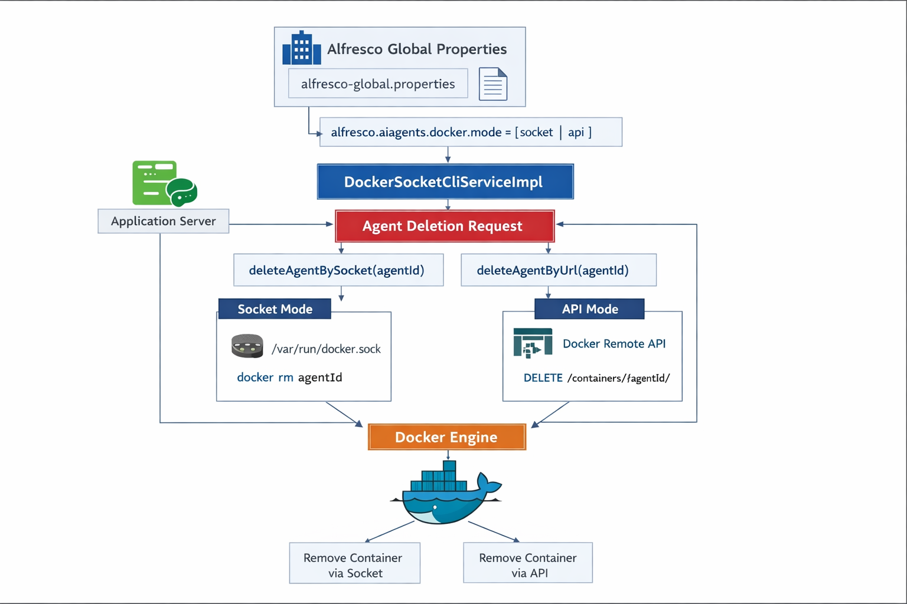

# Alfdockia

<p align="center">
  
</p>

Alfdockia convierte Alfresco Content Services (ACS) en un plano de control para
levantar listeners y agentes dinamicos como contenedores Docker. Alfresco
mantiene el registro, el estado deseado y el estado actual; Docker ejecuta el
runtime; y la configuracion funcional del listener vive como JSON real en el
contenido del nodo.

La API publica permite crear, listar, consultar, parar, arrancar, reiniciar y
eliminar agentes. Alfdockia no interpreta la URL de Alfresco ni la configuracion
de acceso del listener: esas variables se pasan al contenedor mediante `env`.
Lo unico que Alfdockia resuelve de forma especial son secretos declarados con
`prop:<clave>`.

## Arquitectura



## Organizacion del codigo

- `src/main/java/com/alfdockia/agents/webscripts`: endpoints REST de Alfresco Web Scripts.
- `src/main/java/com/alfdockia/agents/service`: validacion, despliegue, runtime y borrado.
- `src/main/java/com/alfdockia/agents/service/docker`: contrato e implementacion Docker.
- `src/main/java/com/alfdockia/agents/service/registry`: persistencia del registro dentro del repositorio.
- `src/main/java/com/alfdockia/agents/service/secrets`: resolucion de `secretRef`.
- `src/main/java/com/alfdockia/agents/service/subsystem`: ciclo de vida del subsistema Alfresco.
- `src/main/java/com/alfdockia/agents/model`: DTOs de la API.
- `src/main/resources/alfresco/module/alfdockia`: modulo, modelo y contextos Spring padre.
- `src/main/resources/alfresco/subsystems/Alfdockia/default`: contexto hijo del subsistema.

## Modelo de datos

El modelo de contenido usa el prefijo `alfdockia`:

```text
Modelo: alfdockia:model
Namespace: http://www.com/model/alfdockia/1.0
Tipo: alfdockia:agent
```

El nodo de registro se crea en `Repositorio > Data Dictionary > Alfdockia Agents`.
Los metadatos se reducen a la informacion operativa:

- `alfdockia:agentId`
- `alfdockia:name`
- `alfdockia:image`
- `alfdockia:desiredState`
- `alfdockia:currentState`
- `alfdockia:health`
- `alfdockia:containerId`
- `alfdockia:createdAt`
- `alfdockia:updatedAt`

La configuracion del agente no se guarda como propiedad del modelo. Se escribe
como contenido JSON del propio nodo, con mimetype `application/json`. Los
secretos no se persisten en claro; solo se guarda la referencia `prop:<clave>`.

## Propiedades globales

Propiedades principales en `alfresco-global.properties`:

```properties
alfresco.alfdockia.docker.enabled=true

alfresco.alfdockia.subsystem.autoStart=true
alfresco.alfdockia.subsystem.startAgentsOnStart=true
alfresco.alfdockia.subsystem.stopAgentsOnStop=true
alfresco.alfdockia.subsystem.stopTimeoutSeconds=10

alfresco.alfdockia.docker.mode=socket
alfresco.alfdockia.docker.socket=/var/run/docker.sock

# Red Docker de los agentes.
# inherit detecta la red del contenedor Alfresco y crea los agentes en ella.
alfresco.alfdockia.docker.network.mode=inherit
# alfresco.alfdockia.docker.network=mi_stack_default
# alfresco.alfdockia.docker.selfContainer=alfresco

# Opcional si se usa Docker Remote API para operaciones soportadas.
# alfresco.alfdockia.docker.baseUrl=https://dockerhost:2376
# alfresco.alfdockia.docker.tls.keystore.path=/opt/alfresco/tls/docker-client.p12
# alfresco.alfdockia.docker.tls.keystore.password=changeit
# alfresco.alfdockia.docker.tls.truststore.path=/opt/alfresco/tls/docker-trust.p12
# alfresco.alfdockia.docker.tls.truststore.password=changeit

alfresco.alfdockia.secret.content_service_password=admin

alfresco.alfdockia.image.allowlist.enabled=false
# alfresco.alfdockia.image.allowlist=alfresco-openmed-pii-listener:,registry.local/listeners/
```

Si se usa Docker por socket, primero consulta el GID del socket en el host:

```bash
stat -c '%g' /var/run/docker.sock
```

Despues revisa estos archivos:

```text
docker/docker-compose.yml
src/main/docker/Dockerfile
```

El `docker-compose.yml` monta `/var/run/docker.sock` en ACS. El `Dockerfile`
instala el CLI de Docker y añade el usuario `alfresco` al grupo que puede usar
el socket.

### Red Docker de los agentes

Por defecto Alfdockia crea cada agente en la misma red Docker que usa el
contenedor de Alfresco. Para hacerlo, inspecciona el contenedor actual mediante
el Docker socket y usa una red no interna, prefiriendo la red `*_default` de
Docker Compose cuando existe.

Cuando Alfresco arranca agentes ya existentes, Alfdockia tambien repara
referencias a redes Docker antiguas. Esto evita que un agente parado quede
bloqueado si el stack fue recreado y Docker cambio el ID interno de la red.

No hay nombres de stack hardcodeados. En un despliegue `alden-innova`, por
ejemplo, Alfdockia detectaria la red real del contenedor Alfresco en tiempo de
ejecucion.

Puedes fijar una red manualmente si el despliegue lo necesita:

```properties
alfresco.alfdockia.docker.network=mi_stack_default
```

Puedes desactivar la herencia y volver al comportamiento Docker por defecto:

```properties
alfresco.alfdockia.docker.network.mode=none
```

Si el runtime no permite identificar el contenedor con `HOSTNAME`, se puede
indicar el contenedor Alfresco a inspeccionar:

```properties
alfresco.alfdockia.docker.selfContainer=nombre_o_id_del_contenedor_alfresco
```

## Contrato de despliegue

El cuerpo de creacion tiene estos campos:

- `name`: nombre unico del agente.
- `image`: imagen Docker del listener o agente.
- `ports`: puertos opcionales.
- `listener.passwordSecretRef.secretRef`: referencia al secreto que se inyecta como `CONTENT_SERVICE_SECURITY_BASICAUTH_PASSWORD`.
- `listener.passwordEnvName`: nombre alternativo de variable para la password, opcional.
- `env`: variables libres para el contenedor.

Alfdockia tambien resuelve cualquier variable de `env` cuyo valor empiece por
`prop:`. Esto permite declarar secretos sin usar el bloque `listener`, por
ejemplo:

```json
{
  "env": {
    "CONTENT_SERVICE_SECURITY_BASICAUTH_PASSWORD": "prop:alfresco.alfdockia.secret.content_service_password"
  }
}
```

La referencia se resuelve contra las propiedades globales de Alfresco. La
configuracion almacenada mantiene `prop:<clave>`, no el valor real.

## Crear un listener OpenMed

Crear un agente despliega el contenedor y crea un nodo de registro:

```bash
curl -u admin:admin \
  -X POST "http://localhost:8080/alfresco/s/api/-default-/public/alfdockia/versions/1/agents" \
  -H "Content-Type: application/json" \
  -d '{
    "name": "openmed-pii-listener",
    "image": "alfresco-openmed-pii-listener:0.0.1-SNAPSHOT",
    "listener": {
      "passwordSecretRef": {
        "secretRef": "prop:alfresco.alfdockia.secret.content_service_password"
      }
    },
    "env": {
      "SPRING_ACTIVEMQ_BROKER_URL": "tcp://alfdockia-activemq:61616",
      "CONTENT_SERVICE_URL": "http://alfdockia-acs:8080",
      "CONTENT_SERVICE_PATH": "/alfresco/api/-default-/public/alfresco/versions/1",
      "CONTENT_SERVICE_SECURITY_BASICAUTH_USERNAME": "admin",
      "CONTENT_SERVICE_PII_TRIGGER_ASPECT": "ompii:piiExtracted",
      "CONTENT_SERVICE_PII_EXTRACTED_ASPECT": "ompii:piiExtracted",
      "OPENMED_EXTRACTOR_SERVICE_URL": "http://openmed-pii-service:8000/extract",
      "OPENMED_EXTRACTION_TARGET_LABELS": "FIRSTNAME,LASTNAME,SSN",
      "OPENMED_EXTRACTION_PROPERTY_MAPPINGS_FIRSTNAME": "ompii:firstName",
      "OPENMED_EXTRACTION_PROPERTY_MAPPINGS_LASTNAME": "ompii:lastName",
      "OPENMED_EXTRACTION_PROPERTY_MAPPINGS_SSN": "ompii:nationalId"
    }
  }'
```

Alfdockia no valida ni genera `CONTENT_SERVICE_URL`, `SPRING_ACTIVEMQ_BROKER_URL`
ni las variables `OPENMED_*`: las pasa al contenedor como configuracion propia
del listener.

## Licenciamiento Community

Sin una licencia AlfDokia valida, el modulo funciona como AlfDokia Community y
permite crear hasta cinco agentes. Las licencias ampliadas se cargan desde
`alfresco.alfdockia.license.path` y deben estar firmadas por AlfDokia.

Consulta la guia completa en:

```text
docs/licenciamiento-alfdokia-community.md
```

Comprobar la edicion efectiva:

```bash
curl -u admin:admin \
  -H "Accept: application/json" \
  "http://localhost:8080/alfresco/s/api/-default-/public/alfdockia/versions/1/license"
```

## Operaciones utiles

Comprobar que el contenedor recibio la password resuelta:

```bash
docker inspect <container_id> \
  --format '{{range .Config.Env}}{{println .}}{{end}}' | grep CONTENT_SERVICE_SECURITY_BASICAUTH_PASSWORD
```

Listar agentes:

```bash
curl -u admin:admin \
  -H "Accept: application/json" \
  "http://localhost:8080/alfresco/s/api/-default-/public/alfdockia/versions/1/agents"
```

Consultar un agente:

```bash
curl -u admin:admin \
  -H "Accept: application/json" \
  "http://localhost:8080/alfresco/s/api/-default-/public/alfdockia/versions/1/agents/agent-6c00f331-342f-4658-9d00-02f3a7d0366a"
```

Parar un agente:

```bash
curl -u admin:admin -X POST \
  "http://localhost:8080/alfresco/s/api/-default-/public/alfdockia/versions/1/agents/agent-6c00f331-342f-4658-9d00-02f3a7d0366a/stop"
```

Arrancar un agente parado:

```bash
curl -u admin:admin -X POST \
  "http://localhost:8080/alfresco/s/api/-default-/public/alfdockia/versions/1/agents/agent-6c00f331-342f-4658-9d00-02f3a7d0366a/start"
```

Reiniciar y actualizar variables del agente:

```bash
curl -u admin:admin \
  -X POST "http://localhost:8080/alfresco/s/api/-default-/public/alfdockia/versions/1/agents/agent-6c00f331-342f-4658-9d00-02f3a7d0366a/restart" \
  -H "Content-Type: application/json" \
  -d '{
    "env": {
      "OPENMED_EXTRACTOR_SERVICE_URL": "http://openmed-pii-service:8000/extract",
      "OPENMED_EXTRACTION_TARGET_LABELS": "FIRSTNAME,LASTNAME,DATEOFBIRTH,SSN"
    }
  }'
```

Actualizar la referencia de password del listener:

```bash
curl -u admin:admin \
  -X POST "http://localhost:8080/alfresco/s/api/-default-/public/alfdockia/versions/1/agents/agent-6c00f331-342f-4658-9d00-02f3a7d0366a/restart" \
  -H "Content-Type: application/json" \
  -d '{
    "listener": {
      "passwordSecretRef": {
        "secretRef": "prop:alfresco.alfdockia.secret.content_service_password_v2"
      }
    }
  }'
```

El endpoint de `restart` fusiona el JSON recibido con la configuracion
almacenada, recrea el contenedor y actualiza el contenido JSON del nodo de
registro. Si un valor del JSON actualizado es `null`, se elimina del contenido
almacenado.

Eliminar un agente:

```bash
curl -u admin:admin -X DELETE \
  "http://localhost:8080/alfresco/s/api/-default-/public/alfdockia/versions/1/agents/agent-6c00f331-342f-4658-9d00-02f3a7d0366a"
```

## Variables inyectadas

Alfdockia solo inyecta variables de forma explicita para secretos:

- `CONTENT_SERVICE_SECURITY_BASICAUTH_PASSWORD`: por defecto, resuelta desde `listener.passwordSecretRef.secretRef`.
- El valor de `listener.passwordEnvName`, si se indica un nombre alternativo.
- Cualquier variable de `env` cuyo valor empiece por `prop:`.

Alfdockia ya no genera variables `ALFRESCO_*`, `LLM_*` ni `AGENT_PROMPT`. La
imagen del listener decide que variables necesita y Alfdockia las transporta sin
acoplarse a Alfresco REST, OpenMed, VLLM u otro microservicio concreto.

## Compilacion

```powershell
mvn test
mvn package
```

El artefacto se genera como:

```text
target/alfdockia-1.0.0.jar
```
